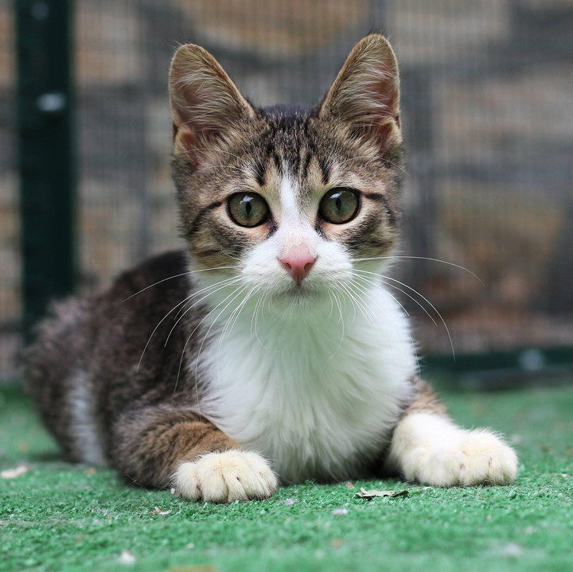
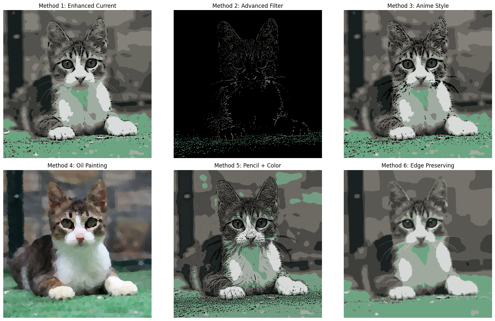

# ML-Cartoonify

A multi-style image cartoonification desktop app built using classical computer vision techniques with OpenCV, scikit-learn, and Tkinter.

## Overview

This project transforms ordinary images into stylized, cartoon-like outputs using traditional image processing methods, no deep learning required. Users can experiment with different styles such as Anime, Pencil Sketch, Oil Painting, and more through a user-friendly GUI. The app offers real-time parameter tuning and visual feedback, making it both a creative tool and an educational platform.

## Features

- Upload and preview images in real-time  
- Choose from 6 cartoon styles:
  - Enhanced Filter
  - Advanced Filter
  - Anime Style
  - Oil Painting
  - Pencil + Color Sketch
  - Edge Preserving
- Tune parameters:
  - Number of colors
  - Blur intensity
  - Edge line size
- Save the stylized image  
- Built entirely with classical techniques (OpenCV, KMeans clustering, adaptive thresholding)

## Technologies Used

- Python 3.10
- OpenCV
- scikit-learn
- Tkinter
- NumPy
- Pillow (PIL)

## Getting Started

### Installation

```bash
pip install opencv-python scikit-learn numpy Pillow
```

Note: The `cv2.xphoto.oilPainting` filter is optional and may require OpenCV-contrib.

### Run the App

```bash
python cartoonify_app.py
```

## Sample Outputs

| Original | Stylized Images |
|----------|-----------------|
|  |  |


## License

MIT License
